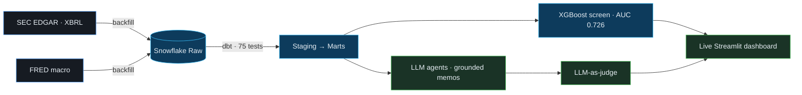

<div align="center">
  
</div>

<div align="center">

<a href="https://readme-typing-svg.demolab.com">
  
</a>

<br/>

[](https://bhavyaupadhyay-portfolio.vercel.app)
[](https://bhavyaupadhyay-portfolio.vercel.app/Bhavya_Upadhyay_Resume_Updated.pdf)
[](https://www.linkedin.com/in/bhavyaupadhyay/)
[](mailto:officiallybhavya@gmail.com)

</div>

<div align="center">

`10M+ records/mo`&nbsp;&nbsp;·&nbsp;&nbsp;`99.9% pipeline SLA`&nbsp;&nbsp;·&nbsp;&nbsp;`498 S&P 500 modeled`&nbsp;&nbsp;·&nbsp;&nbsp;`0.726 test AUC`&nbsp;&nbsp;·&nbsp;&nbsp;`124 tests / 93% cov`

</div>

---

## 🧭 About

I'm a **Data Engineer** (ML on the side) who builds end-to-end data systems — and is honest about how they're built. Streaming and batch ingestion, test-gated transformation pipelines, ML models with real evaluation, and multi-agent LLM systems whose claims trace back to a source.

At **TCS (Air Canada)** I shipped AWS Lambda ETL processing **10M+ records/month**, cut data latency ~50%, and lifted pipeline SLA compliance to **99.9%**. Now finishing my **MS in Data Science at UC Irvine** on a full merit scholarship, while building retention models and KPI dashboards across 20+ graduate programs as a Data Analyst at the Graduate Division.

What I care about: **pipelines that survive real, messy data**, **ML reported with its limitations attached**, and **LLM systems you can actually trust**.

```yaml
role:       Data Engineer / ML Engineer   # full-time, available Jan 2027
strongest:  Python · SQL · AWS · Airflow · dbt · Snowflake
flagship:   EDGAR-X — multi-agent financial intelligence on real SEC data
based:      Irvine, CA
contact:    officiallybhavya@gmail.com
```

---

## 📊 EDGAR-X — How It Actually Works

A **7-layer multi-agent financial intelligence system** on real SEC data. This is the built architecture — not a wishlist. **[🔴 Try the live demo →](https://edgar-x-26rm39rzy6c8fjzyb9pxdt.streamlit.app)**



> Real data on **498 S&P 500 companies** (7,863 XBRL fundamentals rows, 4,758 parsed 10-Ks). The dbt test suite caught **four real extraction bugs**. Agents use **code-supplied provenance** — the model *can't* fabricate a citation — and every memo is independently scored by an LLM judge. Framed honestly as a **ranked screen (test ROC-AUC 0.726)**, not a classifier. Cloud IaC is written as deployment-ready Terraform/Kubernetes but left undeployed to keep it free to run.

---

## 🚀 Featured Projects

| Project | What it is | Stack |
|---|---|---|
| **[📊 EDGAR-X](https://github.com/bhavyaupadhyayy/EDGAR-X)** · [demo](https://edgar-x-26rm39rzy6c8fjzyb9pxdt.streamlit.app) | 7-layer system: SEC/FRED → Snowflake → tested dbt → revenue-direction model + source-grounded LLM agents scored by an automated judge. Honest about what's built vs. deployed. | `Python` `dbt` `Snowflake` `XGBoost` `Anthropic API` `Terraform` |
| **[✈️ Flightline](https://github.com/bhavyaupadhyayy/Flightline-End-to-End-Flight-Data-Pipeline)** | Re-runnable, test-gated US flight pipeline: BTS → Snowflake → dbt (26/26 tests) → live Streamlit, orchestrated with Airflow + a scaffolded Kafka streaming path. CI on every push. | `Airflow` `dbt` `Snowflake` `Kafka` `Docker` |
| **[🛰️ Signal Miner](https://github.com/bhavyaupadhyayy/saas-signal-miner)** | LLM pipeline (LangChain + RAG) turning unstructured data from 250+ sources into clean, validated records. | `LangChain` `RAG` `Supabase` `Docker` |
| **[🔎 Duplicate Detection](https://github.com/bhavyaupadhyayy/bayesian-duplicate-detection)** | Semantic dedup over 250K+ job postings; precision **68% → 92%**, ~3× faster matching via optimized ANN indexing. | `Sentence Transformers` `Milvus` |
| **[🩺 Skin Lesion Classification](https://github.com/bhavyaupadhyayy/skin-lesion-classification)** | EfficientNet-B0 + CBAM on ISIC 2019 (8 classes); 4-variant ablation, Grad-CAM, served via FastAPI. | `PyTorch` `FastAPI` `Grad-CAM` |

---

## 🛠️ Tech Stack

**Languages**
<br/>


**Data Engineering & Cloud**
<br/>


**ML / AI**
<br/>


**Analytics & Viz**
<br/>


---

<div align="center">


</div>

---

<div align="center">
<sub>Building reliable data systems, one tested pipeline at a time.</sub>
</div>
